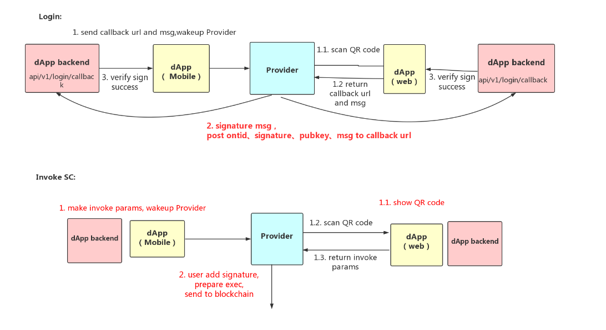

<h1 align="center">ONTO Connector服务接入标准 </h1>
<p align="center" class="version">Version 0.8.0 </p>

## 概述

本文用于指导dapp方如何接入Provider，并使用扫码登陆，扫码调用智能合约等服务。
流程中涉及到的参与方包括：

* Dapp方：对ONT生态内的用户提供Dapp，是本体生态中重要的组成部分。
* Provider：实现dapi mobile规范的钱包

## 交互流程说明



### Login
- 1.1 使用ONTO作为provider扫描dapp方提供的二维码（[登陆二维码标准](#登陆二维码标准)）
- 1.2 ONTO获取到callback url和验证用的msg
- 2 对msg签名，调用登陆方法（[登陆接口](#登陆接口)）
- 3 dapp后端验证签名（[签名验证方法](#签名验证方法)）后返回验证结果

### Invoke SC
- 1.1 使用ONTO作为provider扫描dapp方提供的二维码（[调用合约二维码标准](#调用合约二维码标准)）
- 1.2 使用ONTO扫码
- 1.3 ONTO获得构造后的交易
- 2 ONTO验证签名，添加自己的签名，发送到链上
- 3 dapp后端查询这笔合约交易（[合约查询方法](#合约查询方法)）

## 接入步骤

### 前提条件
要使用ONTO connector，你需要联系[本体机构合作](https://info.ont.io/cooperation/en)

### 登陆接入步骤

#### 登陆二维码标准
扫码获取

```
{
	"action": "login",
	"version": "v1.0.0",
	"params": {
		"type": "ontid or account",
		"dappName": "dapp Name",
		"dappIcon": "dapp Icon",
		"message": "helloworld",
		"expired": "20181215152730", // QR Code expire time
		"callback": "http://127.0.0.1:80/login/callback"
	}
}
```

|字段|类型|定义|
| :---| :---| :---|
| action   |  string |  定义此二维码的功能，登录设定为"Login"，调用智能合约设定为"invoke" |
| type   |  string |  定义是使用ontid登录设定为"ontid"，钱包地址登录设定为"account" |
| dappName   | string  | dapp名字 |
| dappIcon   | string  | dapp icon信息 |
| message   | string  | 随机生成，用于校验身份  |
| callback   | string  |  用户扫码签名后发送到DApp后端URL |

### DApp服务端登陆接口
method: post 

```
{
	"action": "login",
	"version": "v1.0.0",
	"params": {
		"type": "ontid or account",
		"user": "did:ont:AUEKhXNsoAT27HJwwqFGbpRy8QLHUMBMPz",
		"message": "helloworld",
		"publicKey": "0205c8fff4b1d21f4b2ec3b48cf88004e38402933d7e914b2a0eda0de15e73ba61",
		"signature": "01abd7ea9d79c857cd838cabbbaad3efb44a6fc4f5a5ef52ea8461d6c055b8a7cf324d1a58962988709705cefe40df5b26e88af3ca387ec5036ec7f5e6640a1754"
	}
}
```

|字段|类型|定义|
| :---| :---| :---|
| action | string | 定义此二维码的功能，登录设定为"login"，调用智能合约设定为"invoke" |
| params | string | 方法要求的参数 |
| type   |  string |  定义是使用ontid登录设定为"ontid"，钱包地址登录设定为"account" |
| user | string | 用户做签名的账户，比如用户的ontid或者钱包地址 |
| message   | string  | 随机生成，用于校验身份  |
| publickey | string | 账户公钥 |
| signature  |  string |  用户签名 |

#### Response
* Success

```
{
  "action": "login",
  "error": 0,
  "desc": "SUCCESS",
  "result": true
}
```

* Failed

```
{
  "action": "login",
  "error": 8001,
  "desc": "PARAMS ERROR",
  "result": 1
}
```


### 调用合约二维码标准
扫码获取

```
{
	"action": "invoke",
	"version": "v1.0.0",
	"params": {
		"login": true,
		"qrcodeUrl": "http://101.132.193.149:4027/qrcode/AUr5QUfeBADq6BMY6Tp5yuMsUNGpsD7nLZ"
	}
}
```

|字段|类型|定义|
| :---        | :---    | :---                                                              |
| action      | string  | 定义此二维码的功能，登录设定为"Login"，调用智能合约设定为"invoke" |
| qrcodeUrl         | string  | 二维码参数地址                                           |

根据二维码中qrcodeUrl链接，GET的的数据如下：

```
{
	"action": "invoke",
	"version": "v1.0.0",
	"params": {
		"login": true,
		"qrcodeUrl": "http://101.132.193.149:4027/qrcode/AUr5QUfeBADq6BMY6Tp5yuMsUNGpsD7nLZ",
		"message": "will pay 1 ONT in this transaction",
		"invokeConfig": {
			"autosign": true,
			"contractHash": "16edbe366d1337eb510c2ff61099424c94aeef02",
			"functions": [{
				"operation": "method name",
				"args": [{
					"name": "arg0-list",
					"value": [true, 100, "Long:100000000000", "Address:AUr5QUfeBADq6BMY6Tp5yuMsUNGpsD7nLZ", "ByteArray:aabb", "String:hello", [true, 100], {
						"key": 6
					}]
				}, {
					"name": "arg1-map",
					"value": {
						"key": "String:hello",
						"key1": "ByteArray:aabb",
						"key2": "Long:100000000000",
						"key3": true,
						"key4": 100,
						"key5": [100],
						"key6": {
							"key": 6
						}
					}
				}, {
					"name": "arg2-str",
					"value": "String:test"
				}]
			}],
			"payer": "AUr5QUfeBADq6BMY6Tp5yuMsUNGpsD7nLZ",
			"gasLimit": 20000,
			"gasPrice": 500,
			"signature": [{
				"m": 1,
				"signers": ["AUr5QUfeBADq6BMY6Tp5yuMsUNGpsD7nLZ"]
			}]
		}
	}
}


```

##### 签名验证方法
* [java sdk验签](https://github.com/ontio/ontology-java-sdk/blob/master/docs/cn/interface.md#%E7%AD%BE%E5%90%8D%E9%AA%8C%E7%AD%BE)
* [ts sdk验签](https://github.com/ontio/ontology-ts-sdk/blob/master/test/message.test.ts)

##### 合约查询方法
* [java sdk 合约查询](https://github.com/ontio/ontology-java-sdk/blob/master/docs/cn/basic.md#%E4%B8%8E%E9%93%BE%E4%BA%A4%E4%BA%92%E6%8E%A5%E5%8F%A3)
* [ts sdk 合约查询](https://github.com/ontio/ontology-ts-sdk/blob/master/test/websocket.test.ts)
